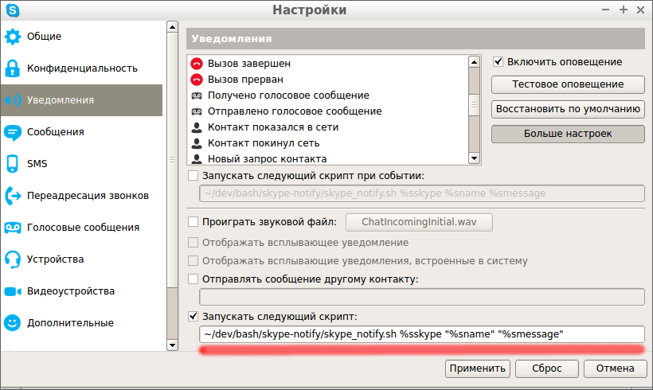

# SkypeNotify

Вывод Skype-уведомлений через notify-osd.

## Использование

Скачайте скрипт. Установите права доступа на испольнение для файла `skype_notify.sh`:

``` shell
$ chmod +x skype_notify.sh
```

Создайте файл конфигурации в своём домашнем каталоге:

``` shell
$ echo skype_name=my_skype_name > .skype_notify
```

где `my_skype_name` имя вашега скайп-аккаунта.

Откройте настройки скайпа и установите параметры для пунктов
"Первое сообщение получено" и "Сообщение получено" в:

``` shell
~\path\to\skype-notify\skype_notify.sh %sskype "%sname" "%smessage"
```

как паказано на картинке:



Вместо `~\path\to\skype-notify\` установите ваш путь до файла `skype_notify.sh`.

## Белый список

Вы можете создать "белый список", т.е. список людей от которых вам будут показываться уведомления, от контактов не входящих в него уведомления показываться не будут.

Файл со списком находится по адресу: `~/.skype_notify.d/white_list`.

Добавляем контакт в белый список:

``` shell
$ echo user.name1 >> ~/.skype_notify.d/white_list
```

Включаем работу по белому списку

``` shell
$ echo "white_list=on" >> ~/.skype_notify
```

Добавление\удаление в\из белого списка, а также его включение\выключение
доступно через [конфигуратор](#Конфигуратор).

## Конфигуратор

Появился скрипт для конфигурирования скрипта `skype_notify.sh`, пока из возможностей только указание
скайп-имени пользователя, просмотр конфигурации и добавление аватара по-умолчанию для контактов у которых
он не установлен.

Для того чтобы воспользоваться конфигуратором установите права на исполнени для файла `configurator.sh`:

``` shell
$ chmod +x configurator.sh
```

Для того чтобы просмотреть справку запустите скрипт без параметров:

``` shell
$ ./configurator.sh
```

## Зависимости

 - sqlite3
 - notify-osd
 - libnotify-bin

## TODO

 - [ ] проверка наличия необходимых программ
 - [ ] отказ от использования утилиты sqlite3 (?)
 - [x] файл конфигурации
 - [x] конфигуратор
 - [x] картинка по-умолчанию для контактов у которых её нет
 - [x] задание картинки для контакта
 - [x] вывод многострочных сообщений с сохранением перехода но новую строку
 - [x] установка собственного аватара для контакта
 - [x] белый список контактов
 - [ ] ~~чёрный список контактов (не показывать уведомления от них)~~
 - [ ] ~~условия показа уведомлений для контактов из чёрного списка~~
 - [ ] показ уведомлений для других событий (звонок, передача файла)
 - [ ] собственные звуки уведомлений
 - [ ] аватары пользователей не зависимо от их присутсвия в списке контактов (?)

